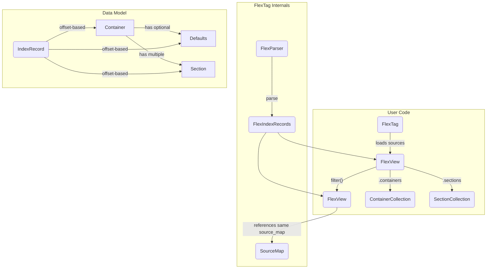

```mermaid
flowchart TB
    subgraph "User Code"
      FT(FlexTag) -- loads sources --> V(FlexView)
      V -- filter() --> V2(FlexView)
      V -- .containers --> CC(ContainerCollection)
      V -- .sections --> SC(SectionCollection)
    end

    subgraph "FlexTag Internals"
      FParser(FlexParser) -- parse --> IRList(FlexIndexRecords)
      IRList --> V
      IRList --> V2
      V2 -- references same source_map --> SRMap(SourceMap)
    end

    subgraph "Data Model"
      Container -- has optional --> Defaults
      Container -- has multiple --> Section
      IR(IndexRecord) -- offset-based --> Container
      IR -- offset-based --> Defaults
      IR -- offset-based --> Section
    end

```