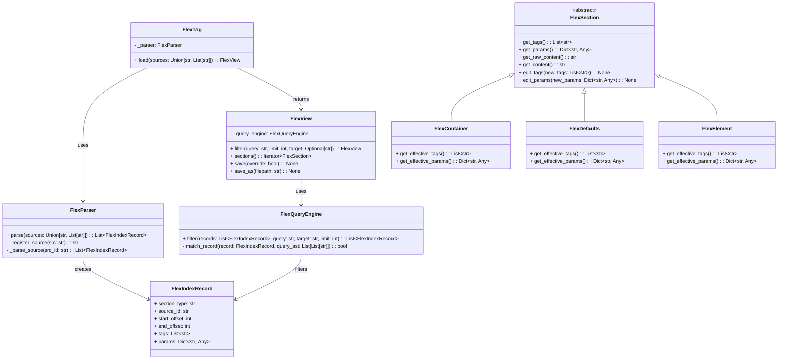

# FlexTag Development Log

## Overview
FlexTag is a system for defining, parsing, querying, and saving data in a specialized "flextag" markup format. The architecture emphasizes:
- **Single-Pass Parsing** (offset-based) to keep memory usage minimal.
- **Lazy Loading**: Content is only loaded from the source when needed.
- **Advanced Querying**: Wildcard tags, nested tags, parameter expressions, AND/OR/NOT logic.
- **Flexible Saving**: Currently does naive full-file overwrite, but plans exist for partial/in-place writes.

Below, you’ll find:
1. **High-Level Mermaid Diagram** showing the core classes and relationships.
2. **Design Patterns & Key Components** explaining how everything fits together.
3. **Next Steps** describing the partial save functionality and improved unit tests.

## Mermaid Diagram

## Key Components & How It Works

### 1. **FlexParser**
- Performs a **single-pass, line-by-line** read to identify `[[C]]`, `[[D]]`, `[[E]]`, etc.
- Records minimal metadata in `FlexIndexRecord`: offsets, tags, params, and the source identifier.
- **Minimal Memory Usage**: Doesn’t store content inline; only references to offsets.

### 2. **FlexIndexRecord**
- Stores the crucial offset data (`start_offset`, `end_offset`) plus parsed tags and params.
- Enables **lazy loading** of content: we only re-read source lines when needed.

### 3. **FlexSection** (abstract) and its Subclasses
- `FlexContainer` (`[[C]]`)
- `FlexDefaults` (`[[D]]`)
- `FlexElement` (`[[E]]`)
- Each subclass uses the same lazy mechanism to retrieve content from its corresponding `FlexIndexRecord`.

### 4. **FlexView**
- Primary object returned by `FlexTag.load()`.
- Holds a list of `FlexIndexRecord` objects and the `source_map` (mapping source IDs to file paths or raw strings).
- **.filter(...)** uses `FlexQueryEngine` to apply advanced queries (wildcards, nested tags, params, etc.).
- **.sections()** yields actual `FlexSection` objects lazily.

### 5. **FlexQueryEngine**
- Implements logic for searching tags, nested tags, parameters, and boolean/AND/OR logic.
- Uses a cached parser for queries (`parse_query_cached`) to transform strings into an AST.
- Efficiently filters records based on the user’s criteria.

### 6. **Saving**
- Currently, `.save(override=True)` overwrites each source with a naïve rebuild from the records. 
- `.save_as("...")` combines everything into one new flextag file.

### 7. **Pattern Matching**
- Supports `#tag*`, `#*tag`, `#?tag`, `#tag?`, etc.
- Nested tags like `#tag.subtag`.
- Parameter expressions like `param=val`, `param>3`, `param!=null`.
- Implicit AND within each space-separated chunk, OR if separated by the keyword `OR`.

## Next Steps

1. **Partial Save / Edit**  
   - Allow editing a single `[[E]]` (or `[[C]]`, `[[D]]`) without rewriting the entire file.
   - Possibly do a bottom-up approach for re-writing lines or a streaming approach.

2. **Focusing on Single-Container**  
   - Start with one container to simplify partial writes. Multiple containers can come later.

3. **Extensive Unit Tests**  
   - Edge cases with multi-line tags, complex escaping, big data sets.
   - Confirm partial saves do not break offsets for subsequent sections.

4. **Refactoring into Separate Modules**  
   - `flex_parser.py`, `flex_model.py`, `flex_query.py`, etc. 
   - Maintain test coverage with each step.

## Conclusion
We have a **functional** FlexTag system with:
- **Lazy, offset-based** design for efficient reading.
- **Advanced filtering** with wildcard tags and parameter queries.
- **Naïve saving** approach.

**Next** we’ll implement partial/in-place saves for single containers, refine the test suite for edge cases, and consider real-world usage to validate the format’s viability. Once these tasks are completed, we’ll finalize the `0.x` alpha release and gather feedback from potential users.

